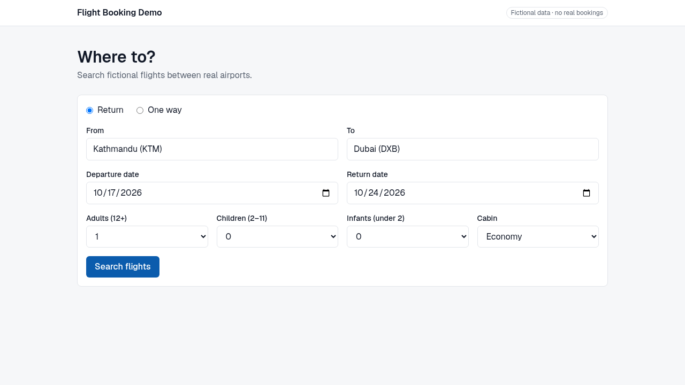
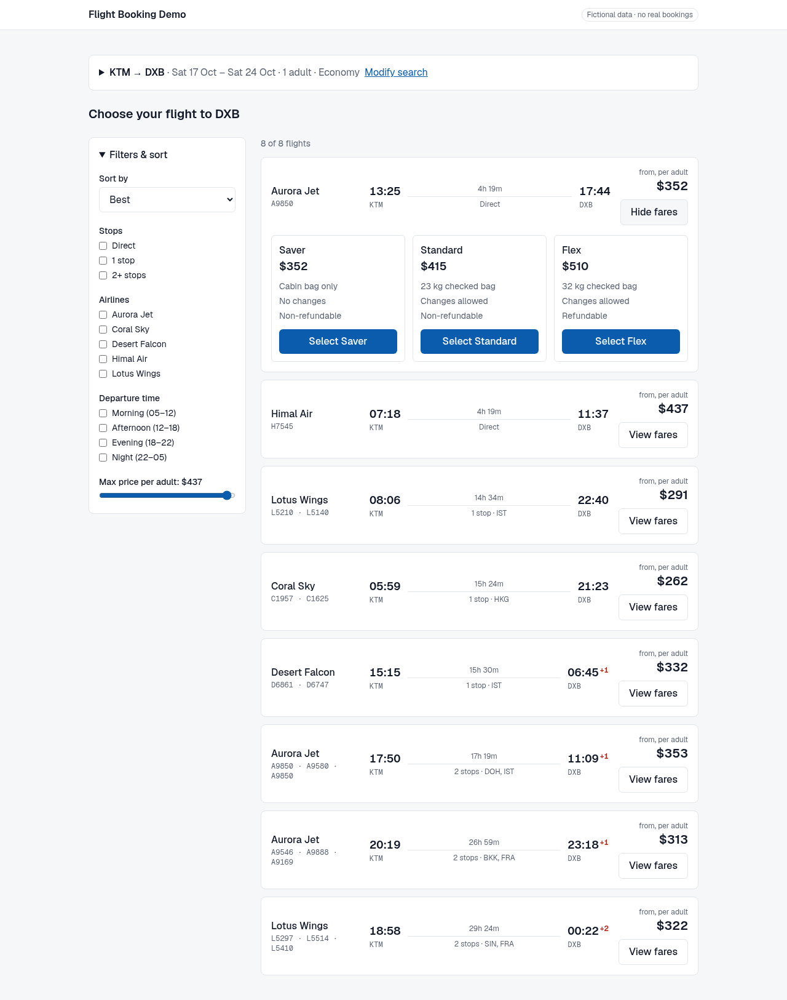
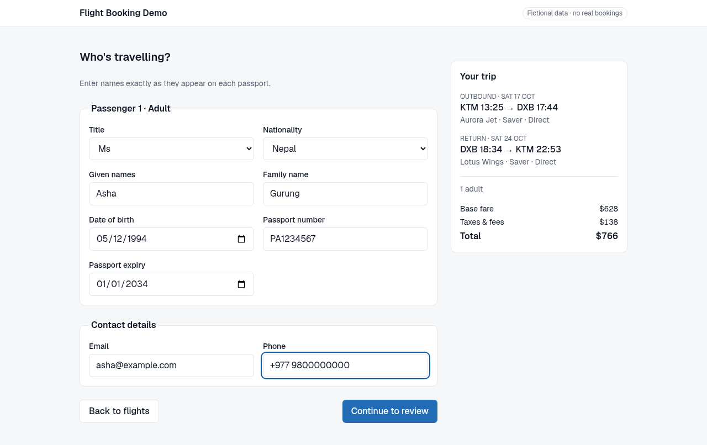
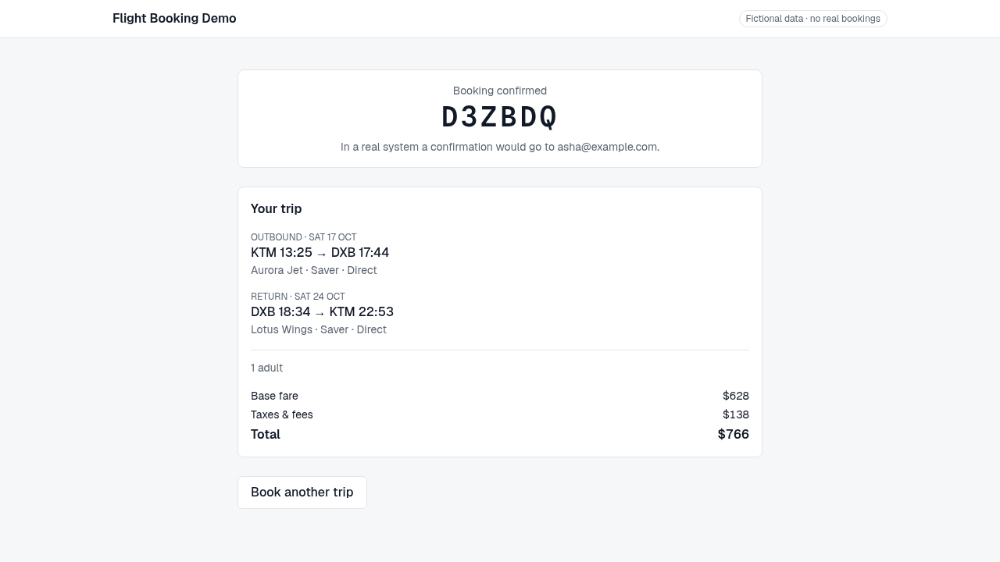

# Flight Booking Demo

A search → book flight flow built to show how I approach complex booking UIs: URL-driven search state, server-rendered results with client-side caching, typed multi-passenger forms, and a fare re-check before confirming.

**Live demo:** https://flight-booking-demo.vercel.app · **All data is fictional** (real airport codes, made-up airlines, no real bookings).

| Search                         | Results                         | Passengers                         | Confirmation                         |
| ------------------------------ | ------------------------------- | ---------------------------------- | ------------------------------------ |
|  |  |  |  |

## Stack

Next.js (App Router) · React 19 · TypeScript · Tailwind CSS · TanStack Query · Zustand · React Hook Form · Zod · Vitest · Playwright

## Decisions & trade-offs

- **The URL owns search and filter state.** Results are shareable, bookmarkable and survive refresh/back. Filter changes use the native History API, so they don't trigger a server round trip.
- **Server first, client after.** `/flights` prefetches results on the server and hydrates them into TanStack Query. Filtering and sorting run over the cache with zero network calls.
- **Zustand holds only what isn't server data:** selected fares, the in-progress passenger draft (sessionStorage, so a refresh doesn't lose input) and the last confirmation. Flight data is never copied into it.
- **Validation lives in Zod schemas** shared by forms, route handlers and API responses. Responses are parsed at the boundary, so contract drift fails loudly instead of rendering `undefined`. Age rules are checked on the travel date; "not in the past" uses the browser's local date so users east of UTC aren't blocked.
- **A mock API that behaves like a real one.** Route handlers return seeded, deterministic offers with 300–900 ms latency and occasional 503s. Fares drift over time, so the review step re-prices every leg and asks you to accept a changed fare. Bookings are idempotent per request id, so double clicks and retries can't double-book.
- **Simplifications:** no time zones (all times in one clock), in-memory booking store, confirmation kept in the browser tab, server-side passenger checks limited to shape. Against a real GDS/NDC API, I'd add offer expiry, server-side validation of passenger rules, and a persisted booking store.

## Run locally

```bash
yarn install
yarn dev            # http://localhost:3000
yarn test           # unit tests (Vitest)
yarn e2e            # end-to-end happy path (Playwright, uses local Chrome)
yarn type-check && yarn lint
```

Set `MOCK_NETWORK=off` to disable latency and random failures, and `MOCK_FREEZE_PRICES=1` to stop fare drift.
